# 1. Project Title & Tagline

## **SwasthAI — Bolkar Batao. Samay Par Sambhalo.**

> **A bilingual, voice-first health-screening companion that converts symptoms, contextual answers, and optional photos into safety-focused next steps—before delay becomes risk.**

SwasthAI is a mobile-first Hindi/English Progressive Web App (PWA) and Capacitor-ready Android application. It makes preliminary health screening more accessible through **spoken or typed symptom intake**, **guided follow-up questions**, **optional multimodal image analysis**, **early red-flag routing**, and **structured care guidance**.

The system is deliberately positioned as a **screening and decision-support tool—not a diagnostic device**. It does not confirm disease, prescribe medication, or replace a qualified medical professional.

## Local development with live AI

1. Copy `.env.example` to `.env`.
2. Put your Groq key in `GROQ_API_KEY`. Keep it server-side and never rename it to a `VITE_*` variable.
3. Install dependencies with `npm install`.
4. Run the frontend and API together with `npm run dev:full`.
5. Open the Vite URL shown in the terminal (normally `http://localhost:5173`). Vite forwards `/api/*` to the local server on port `8787`.

On Windows PowerShell, use `npm.cmd` in place of `npm` if the system execution policy blocks `npm.ps1`.

The default setup uses Groq's OpenAI-compatible Chat Completions API with strict Structured Outputs and image inputs. `AI_MODEL` defaults to `qwen/qwen3.8-27b`. You can switch to OpenAI or another compatible multimodal provider through environment variables without editing application code. See `.env.example` for each configuration. The selected provider and model must support image inputs and JSON Schema structured output.

For a production-style local run, use `npm run build` followed by `npm start`; the same Node server then serves both `dist/` and `/api/analyze`. Provider free-tier limits and model availability can change, so check the provider's current console before a demo.

The deterministic demo is no longer a silent fallback. To use it deliberately for a presentation without making API calls, set `VITE_ENABLE_DEMO_AI=true` before starting or building the frontend. Real deployments should leave it `false`.

## Vercel deployment

The repository includes Vercel Functions at `/api/health` and `/api/analyze`; both reuse the same validation, emergency routing, provider configuration, and structured-result schema as the local Node server.

In Vercel Project Settings, add these variables for **Production** (and Preview if needed), then redeploy:

```env
AI_PROVIDER=groq
GROQ_API_KEY=your_own_groq_key
AI_MODEL=qwen/qwen3.8-27b
AI_API_STYLE=chat-completions
```

Do not add `VITE_` to the key name. After deployment, `/api/health` should return JSON with `"aiConfigured": true`; it never returns the secret itself.

# 2. Problem Statement & Root Causes

## **Problem statement**

People in rural, semi-urban, and resource-constrained communities often delay seeking appropriate care because they cannot easily describe symptoms, assess urgency, or determine the correct next step. Existing symptom-checking tools are frequently text-heavy, English-first, disconnected from visual evidence, or unsafe when urgent symptoms require immediate escalation.

| Root cause | Gap in traditional methods | Consequence |
| --- | --- | --- |
| **Language and health-literacy barriers** | Forms and health portals rely on medical vocabulary and English text input. | Users may omit important symptoms, misunderstand advice, or abandon the process. |
| **Fragmented symptom assessment** | A single complaint or photo is reviewed without duration, severity, progression, age group, or other context. | Screening becomes generic and visually similar conditions may be confused. |
| **Delayed recognition of emergencies** | Manual triage or an ordinary chatbot may process the full workflow before reacting to chest pain, breathing difficulty, seizures, heavy bleeding, or sudden weakness. | Time-critical cases can lose valuable minutes. |
| **Access, cost, and connectivity constraints** | Specialist access may require travel, repeated consultations, high-bandwidth video calls, or continuous internet. | Early screening becomes expensive and inaccessible to the people who need it most. |

SwasthAI addresses the gap between **“I feel unwell”** and **“I know how urgently and where to seek help”** by turning informal symptom descriptions into a consistent, explainable, bilingual screening report.

# 3. Proposed Solution & Workflow

## **End-to-end screening flow**

1. **Language and accessibility setup**
   The user selects **Hindi or English**, with persistent language and light/dark theme preferences. Each guided stage can be read aloud through browser or native text-to-speech.

2. **Voice or text symptom capture**
   The user describes the problem naturally by typing or tapping the microphone. Browser speech recognition supports `hi-IN` and `en-IN`, while typing remains available when speech recognition is unsupported or permission is denied.

3. **Instant red-flag screening**
   A client-side rules engine checks Hindi and English phrases for emergency indicators such as severe chest pain, breathing difficulty, unconsciousness, seizures, heavy bleeding, face droop, sudden weakness, and self-harm language. A match **bypasses the normal AI flow** and presents an immediate **112 emergency call action**.

4. **Contextual clinical questions**
   The app asks four structured questions about **duration, severity, progression, and age group**. This adds essential context that a photo-only or one-message checker lacks.

5. **Optional guided image capture**
   The user may skip photos or add up to three role-specific images: a visible-symptom overview, close-up, and contextual view. Images can come from the device camera or gallery and are resized client-side to approximately **1,000 px maximum dimension** and compressed as **WebP** before analysis.

6. **Multimodal AI request**
   Symptoms, answers, language, and ordered optional images are sent to the repository's **server-side `/api/analyze` endpoint**. The server validates request size and image types, keeps the model prompt and API key off the browser, and calls the configured Groq, OpenAI, or compatible multimodal API.

7. **Schema validation and safety normalization**
   The response is parsed defensively and normalized into a fixed structure: risk level, confidence, summary, possible conditions, supporting evidence, image assessment, conservative home care, diet guidance, symptoms to monitor, red flags, and recommended timing for professional care. The prompt explicitly prohibits confirmed diagnoses, unsupported certainty, and medication dosages.

8. **Actionable bilingual result**
   Results are localized through a medical translation dictionary and displayed as a clear report. Users can **print, share, copy, revisit, search, filter, or delete** locally stored screening summaries. High-risk results retain a visible emergency action.

9. **Explicit prototype mode**
   The deterministic demonstration engine is available only when `VITE_ENABLE_DEMO_AI=true`. A missing server or API key now produces a visible retryable error instead of silently showing a hard-coded disease result.

# 4. Tech Stack & Architecture

## **Technologies implemented in this repository**

| Layer | Technology | Role in SwasthAI |
| --- | --- | --- |
| **Frontend** | React, React DOM, React Router | Component-driven UI, route-based workflow, reusable state, and navigation. |
| **Build system** | Vite, `@vitejs/plugin-react` | Fast local development and optimized production bundles. |
| **UI and accessibility** | CSS, Lucide React | Responsive mobile-first interface, dark mode, safe-area support, keyboard focus states, reduced-motion support, and printable reports. |
| **Web voice** | Web Speech Recognition API, Speech Synthesis API | Hindi/English speech-to-text input and spoken prompts with typed fallback. |
| **Camera and image processing** | MediaDevices API, Canvas API, WebP | Live camera capture, gallery input, image resizing, and bandwidth-aware compression. |
| **Native/mobile bridge** | Capacitor Core, Capacitor Camera, Capacitor Android, Capacitor Community Text-to-Speech | Android-ready access to native camera and speech capabilities. |
| **PWA/mobile web** | Web App Manifest, responsive CSS, route-level lazy loading | Install-like presentation and smaller initial JavaScript delivery. A service worker is not yet included, so full offline application caching is not claimed. |
| **Client state and storage** | React Context and Hooks, `sessionStorage`, versioned `localStorage` | Resumable active screening, local history, theme/language persistence, legacy-data migration, and quota-safe image removal. |
| **AI integration** | Groq/OpenAI-compatible APIs, image inputs, strict JSON Schema Structured Outputs, configurable provider and model | Combines symptom text, contextual answers, and optional images while enforcing predictable output fields. |
| **Safety intelligence** | Hindi/English red-flag regex engine, response normalizer, medical translation dictionaries | Emergency bypass, uncertainty-aware results, bilingual medical terms, and conservative guidance. |
| **Backend and database** | Dependency-free Node HTTP server with `/api/analyze` and `/api/health`; no cloud database | Keeps provider API keys, prompt policy, validation, timeout handling, and provider errors server-side. Screening history remains on the user's device by design. |

## **Logical architecture**

```mermaid
flowchart LR
    U[User: Hindi / English] --> I[React PWA or Capacitor App]
    I --> S[Voice or Text Symptoms]
    S --> R{Local Red-Flag Engine}
    R -->|Emergency phrase| E[Emergency Screen and 112 Action]
    R -->|Continue| Q[Context Questions]
    Q --> P[Optional Guided Photos]
    P --> C[Client-side Resize and WebP Compression]
    C --> A[Structured Multimodal Request]
    A --> X[Authenticated Stateless AI Proxy]
    X --> M[Configured Multimodal Model]
    M --> V[Schema Validation and Safety Normalization]
    V --> O[Bilingual Screening Report]
    O --> L[Local History / Print / Share]
```



## **Privacy and medical-safety boundaries**

- **No model API key is exposed in client code**; inference passes through the included Node server and reads the selected provider key only from its environment.
- **Photos are optional**, and saved history excludes raw image data to reduce privacy and storage risk.
- **Emergency phrase detection runs locally** and does not wait for AI inference.
- **No central database is active in the prototype**; cloud persistence, analytics, or clinician dashboards require explicit consent and a production backend.
- Clinical validation, privacy impact assessment, security testing, accessibility testing, and applicable medical-device/regulatory review are mandatory before public clinical deployment.

# 5. Scalability & Feasibility (CRITICAL FOR JUDGING)

## **Why the current design can scale to thousands of users**

- **CDN-friendly frontend:** The Vite build produces static assets that can be distributed through low-cost object storage and a CDN. Route-level lazy loading reduces initial load, while a single deployment can serve large concurrent traffic without per-user frontend compute.
- **Stateless inference boundary:** `/api/analyze` defines a clean client-to-server contract. Multiple identical server instances can run behind an API gateway or load balancer because each request contains all data required for one screening. `VITE_AI_PROXY_URL` can point the client to a separately deployed endpoint when needed.
- **Reduced network and inference load:** Photos are optional, capped at three, resized before upload, and WebP-compressed on the device. This lowers latency, mobile-data usage, model input size, and per-screening AI cost.
- **No database bottleneck for prototype history:** Active sessions and reports are versioned and stored locally. The core screening experience therefore does not require a database read/write for every screen transition.
- **Standard-device execution:** Red-flag checks, image preprocessing, localization, and UI logic run in an ordinary modern browser or Android WebView. Users do not need a GPU or on-device ML accelerator; heavy multimodal inference remains server-side.
- **Graceful capability fallback:** Voice, camera, and sharing use feature detection. Typing, gallery upload, clipboard, and print alternatives keep the primary workflow usable when a device API is unavailable.

## **Production scale-out blueprint**

| Scale concern | Production approach | Feasibility and cost advantage |
| --- | --- | --- |
| **Traffic spikes** | CDN for static assets; load-balanced, autoscaling stateless proxy workers. | Frontend traffic is inexpensive; compute scales only when users request analysis. |
| **AI rate limits and cost** | Per-user quotas, request-size limits, model routing, queue-based back-pressure, timeouts, and usage monitoring. | Prevents abuse and makes inference expenditure measurable and controllable. |
| **Sensitive data** | TLS, short-lived authentication, consent logging, redaction, encryption at rest, and default non-retention of photos. | Minimizes stored health data and reduces both breach surface and storage cost. |
| **Multi-device history** | Add an encrypted relational/document database only for consenting users; store media separately with short retention. | Preserves the local-first model while enabling optional continuity and clinician workflows. |
| **Reliability** | Health checks, structured logs without raw medical content, metrics, retry policy, circuit breakers, and a safe “service unavailable” state. | Isolates provider failures without turning uncertain output into medical advice. |
| **Regional reach** | Deploy proxy workers near target regions and serve cached static/localization assets from edge locations. | Improves response time without changing the application architecture. |

## **Low-bandwidth and offline feasibility**

- A user can complete the text/question flow **without uploading any image**.
- WebP resizing occurs before transmission, avoiding original-resolution mobile uploads.
- Existing local reports and incomplete sessions can be reopened from device storage.
- The app detects loss of connectivity and blocks new remote analysis instead of pretending to return a live result.
- The manifest provides an install-like mobile experience; a service worker and offline asset cache are the next step for true intermittent-connectivity deployment.

## **What is ready versus what must be hardened**

**Implemented now:** complete bilingual screening UX, voice/text intake, local and server-side emergency routing, contextual questions, optional guided capture, client image optimization, server-side Groq/OpenAI-compatible integration, strict shared AI schema, explicit demo mode, local history, responsive/dark/print UI, and Capacitor configuration.

**Required before a field pilot:** deploy the API behind authentication and rate limits, evaluate the selected model on clinician-reviewed cases, add observability without logging raw health content, run security/privacy reviews, validate translations and red-flag coverage with clinicians, test on entry-level Android devices and weak networks, and obtain ethics/regulatory approval appropriate to the deployment scope.

# 6. Unique Selling Proposition (USP) & Competitor Edge

- **Context-first multimodal screening:** Unlike photo-only classifiers or single-message symptom bots, SwasthAI combines free-form symptoms, four clinical context signals, and up to three guided visual perspectives before producing structured guidance.
- **Safety before intelligence:** Emergency indicators are checked locally and can bypass AI analysis entirely. This is faster and more dependable than waiting for a cloud model to finish a standard conversational flow.
- **Designed for Bharat, not merely translated:** Hindi and English are supported across voice input, spoken prompts, UI content, medical terms, validation messages, and results; text fallback protects access on unsupported devices.
- **Low-cost, privacy-conscious architecture:** Optional compressed photos, static frontend hosting, local history, no client-side AI secret, and pay-per-analysis server inference reduce infrastructure cost and unnecessary health-data retention.

# 7. Target Audience & Impact

## **Primary users**

- **Individuals and caregivers** in rural, semi-urban, and underserved communities who need understandable first-step guidance.
- **Hindi-first and low-literacy users** who communicate more naturally through speech than medical forms.
- **Community health workers and frontline volunteers** who need a consistent intake structure before referral.
- **Telemedicine and primary-care teams** that can use the shareable report as a pre-consultation summary rather than repeating the entire intake.

## **Expected workflow impact**

- Converts an unstructured complaint into a **standardized, bilingual screening summary**.
- Surfaces time-sensitive warning signs at the beginning of the journey, not at the end.
- Reduces avoidable image size and enables screening even when the user chooses not to share a photo.
- Gives users one actionable view of **possible conditions, urgency, conservative care, diet, monitoring signs, and professional-care timing**.
- Creates continuity through resumable sessions and searchable local history without requiring an account or cloud database.

## **SIH pilot success metrics**

The following are **evaluation targets—not yet claimed clinical outcomes**:

| Pilot KPI | Target for validation |
| --- | --- |
| **Median guided-screening completion time** | **5 minutes or less** from symptom entry to structured report. |
| **Emergency-route response time** | **Under 1 second** after a configured red-flag phrase is submitted on the client. |
| **Completion on entry-level Android devices** | **At least 85%** task completion, including users who fall back from voice to typing. |
| **Frontline intake efficiency** | **30% reduction** in repeated symptom-documentation time during supervised pilot consultations. |
| **Low-bandwidth viability** | Successful text-only screening over constrained mobile networks; measure median request size separately for 0–3 images. |
| **Safety quality** | Clinician-reviewed precision/recall for red-flag routing, zero medication-dosage output, and documented escalation for high-risk cases. |

SwasthAI's intended impact is not to replace doctors. It is to make the path to the **right level of care clearer, earlier, safer, and more inclusive**.
