# SwasthAI

**Bolkar Batao. Samay Par Sambhalo.**

> **A bilingual, voice-first health-screening companion that converts symptoms, contextual answers, and optional photos into safety-focused next steps—before delay becomes risk.**

SwasthAI is a mobile-first Hindi/English web app with a Capacitor Android project. Users describe symptoms by voice or text, answer contextual questions, optionally add photos, and receive a structured screening report with urgency guidance.

**Safety boundary:** This is a screening aid, not a diagnosis or prescription. An urgent warning should lead to professional or emergency care, not another AI check.

## What the app includes

| Feature | Current behavior |
| --- | --- |
| Bilingual intake | Hindi/English text and microphone input, with typed fallback. |
| Adaptive questions | The AI selects 2–4 relevant questions from a predefined bilingual question bank; a local selection is used if that call fails. |
| Caregiver mode | Record whether the screening is for yourself, a child, parent, partner, or someone else; the patient's age group is asked separately. |
| Medicine and allergy context | Optional fields are passed to the screening model for safety context, without automatic prescribing. |
| Photo assistant | Checks an optional photo for relevance and quality before it is kept. The final analysis checks photo-to-description consistency again and excludes mismatched photos from evidence. |
| Progress checks | Start a linked repeat screening, compare reported severity/progression, and view saved photo thumbnails side by side. The trend is based on answers, not an automated diagnosis from photos. |
| Clinician report | A print-ready report includes symptoms, answers, photo context, observations, red flags, and next steps. Use the browser's **Print / Save PDF** action. |
| Spoken results | Reads the summary, warning signs, and recommended professional-care step aloud when device speech is available. |
| Safety routing and history | Local red-flag checks can bypass AI; completed reports are searchable in device-local history. |

## Quick start

Requirements: Node.js, npm, and a key for a multimodal model that supports image input and JSON Schema structured output.

```bash
npm install
```

Copy `.env.example` to `.env` and replace `GROQ_API_KEY` with your own key. The example value is a placeholder. Then start both the frontend and API:

```bash
npm run dev
```

Open `http://localhost:5173`. Check `http://localhost:5173/api/health`; `"aiConfigured": true` means the server found a provider key. On Windows PowerShell, use `npm.cmd` if `npm.ps1` is blocked by execution policy.

| Command | Purpose |
| --- | --- |
| `npm run dev` | Start Vite and the local API together. |
| `npm run dev:web` | Start only Vite; AI calls require a separate API. |
| `npm run api` | Start only the local API (default port `8787`). |
| `npm test` | Run the automated tests. |
| `npm run build` | Build the web app into `dist/`. |
| `npm start` | Serve the built app and API from one Node process. |

The API key stays in the server environment; never use a `VITE_*` variable for a secret or commit `.env`. Groq is the default provider. The provider, model, API style, and compatible-provider URL can be changed through `.env`. To give translation its own key and quota, set `TRANSLATION_API_KEY` on the server. You can also set `TRANSLATION_PROVIDER`, `TRANSLATION_MODEL`, `TRANSLATION_BASE_URL`, and `TRANSLATION_API_STYLE` if the translation provider differs from screening. If you set any `TRANSLATION_*` variable, a translation key is required. Without these settings, translation uses the screening provider.

Each screening may use one call for adaptive questions, one per checked photo, one for final analysis, and one to prepare the report in the other language. The translated version is saved with that screening on the device, so later switches and history views do not call the translation API again. These calls count toward their respective provider quotas. `VITE_ENABLE_DEMO_AI=true` replaces **final analysis** with a demonstration result; adaptive questions and photo checks may still call the API, so it is not a fully offline mode.

## Vercel deployment

Deploy the repository as a Vite project and set these **Environment Variables** in Vercel Project Settings for Production (and Preview if needed):

```env
AI_PROVIDER=groq
GROQ_API_KEY=your_own_groq_key
AI_MODEL=qwen/qwen3.8-27b
AI_API_STYLE=chat-completions
# Optional: a separate key for translating reports
TRANSLATION_API_KEY=your_translation_only_key
```

Redeploy after changing variables. Open `https://YOUR-DEPLOYMENT/api/health` and confirm `"aiConfigured": true`. The endpoint does not return the key. See `.env.example` for OpenAI or another compatible provider. Use a model that supports **both images and structured JSON output**.

## Why it exists

### The problem

People in rural, semi-urban, and resource-constrained communities often delay seeking appropriate care because they cannot easily describe symptoms, assess urgency, or determine the correct next step. Existing symptom-checking tools are frequently text-heavy, English-first, disconnected from visual evidence, or unsafe when urgent symptoms require immediate escalation.

| Root cause | Gap in traditional methods | Consequence |
| --- | --- | --- |
| **Language and health-literacy barriers** | Forms and health portals rely on medical vocabulary and English text input. | Users may omit important symptoms, misunderstand advice, or abandon the process. |
| **Fragmented symptom assessment** | A single complaint or photo is reviewed without duration, severity, progression, age group, or other context. | Screening becomes generic and visually similar conditions may be confused. |
| **Delayed recognition of emergencies** | Manual triage or an ordinary chatbot may process the full workflow before reacting to chest pain, breathing difficulty, seizures, heavy bleeding, or sudden weakness. | Time-critical cases can lose valuable minutes. |
| **Access, cost, and connectivity constraints** | Specialist access may require travel, repeated consultations, high-bandwidth video calls, or continuous internet. | Early screening becomes expensive and inaccessible to the people who need it most. |

SwasthAI addresses the gap between **“I feel unwell”** and **“I know how urgently and where to seek help”** by turning informal symptom descriptions into a consistent, explainable, bilingual screening report.

## Screening workflow

1. Choose Hindi or English and type or speak symptoms. Typing works when speech recognition is unavailable.
2. Local Hindi/English red-flag rules route recognized emergencies to an urgent screen with an India `112` call action.
3. Answer duration, severity, progression, and patient age-group questions. `/api/follow-up` selects 2–4 additional questions from a fixed bilingual bank. A local symptom-based selection is used if that call fails.
4. Optionally take or upload up to three photos. The app compresses them to WebP; `/api/photo-check` checks relevance and quality, with local darkness/blur checks if the remote check fails. A warning does not silently discard a photo.
5. Add optional medicine and allergy context and review the entered information.
6. `/api/analyze` validates the request server-side and asks the configured model for a structured screening result. It checks whether each photo actually supports the description; mismatched or unclear photos do not become image evidence and lower confidence.
7. Review urgency, possible conditions, supporting evidence, warning signs, and a suggested professional-care step. When the result page opens, `/api/translate-report` prepares the other language and stores it with the screening. Switching between Hindi and English then uses the saved versions without another API call. A short provider rate limit is retried once; longer limits temporarily disable new translation attempts. If translation fails, the app keeps the original language and can retry when the user switches languages. Read key results aloud, share a text summary, or use the browser print dialog to save the clinician report as PDF.
8. If appropriate, start a linked screening later. The app compares reported severity/progression and displays any saved photo thumbnails side by side.

### API endpoints

| Endpoint | Purpose |
| --- | --- |
| `GET /api/health` | Reports whether the provider is configured, without exposing its key. |
| `POST /api/follow-up` | Selects relevant question IDs from the predefined question bank. |
| `POST /api/photo-check` | Checks one image against the reported symptoms for relevance and usability. |
| `POST /api/analyze` | Produces the final structured screening response. |
| `POST /api/translate-report` | Translates user-facing report text while preserving clinical risk and status fields. Requires a configured AI provider; the first switch uses an additional provider call. |

Local development uses the Node server in `server/`; Vercel uses matching functions in `api/`. Provider calls stay on the server. The model must support the configured JSON Schema format.

## Tech stack and architecture

### Technologies in this repository

| Layer | Technology | Role in SwasthAI |
| --- | --- | --- |
| **Frontend** | React, React DOM, React Router | Component-driven UI, route-based workflow, reusable state, and navigation. |
| **Build system** | Vite, `@vitejs/plugin-react` | Fast local development and optimized production bundles. |
| **UI and accessibility** | CSS, Lucide React | Responsive mobile-first interface, dark mode, safe-area support, keyboard focus states, reduced-motion support, and printable reports. |
| **Web voice** | Web Speech Recognition API, Speech Synthesis API | Hindi/English speech-to-text input and spoken prompts with typed fallback. |
| **Camera and image processing** | MediaDevices API, Canvas API, WebP | Live camera capture, gallery input, image resizing, and bandwidth-aware compression. |
| **Native/mobile bridge** | Capacitor Core, Capacitor Camera, Capacitor Android, Capacitor Community Text-to-Speech | Android-ready access to native camera and speech capabilities. |
| **PWA/mobile web** | Web App Manifest, responsive CSS, route-level lazy loading | Install-like presentation and smaller initial JavaScript delivery. A service worker is not yet included, so full offline application caching is not claimed. |
| **Client state and storage** | React Context and Hooks, `sessionStorage`, versioned `localStorage` | Resumable active screening, local history, theme persistence, legacy-data migration, and quota-safe image removal. |
| **AI integration** | Groq/OpenAI-compatible APIs, image inputs, strict JSON Schema Structured Outputs, configurable provider and model | Combines symptom text, contextual answers, and optional images while enforcing predictable output fields. |
| **Safety intelligence** | Hindi/English red-flag regex engine, response normalizer, medical translation dictionaries | Emergency bypass, uncertainty-aware results, bilingual medical terms, and conservative guidance. |
| **Backend and database** | Dependency-free Node HTTP server and Vercel functions; no cloud database | Handles the five API endpoints, protects provider keys, validates requests, and normalizes provider errors. Screening history and cached translations remain on the user's device. |

### Logical architecture

```mermaid
flowchart LR
    U[User: Hindi / English] --> I[React PWA or Capacitor App]
    I --> S[Voice or Text Symptoms]
    S --> R{Local Red-Flag Engine}
    R -->|Emergency phrase| E[Emergency Screen and 112 Action]
    R -->|Continue| Q[Core and Adaptive Questions]
    Q --> P[Optional Guided Photos]
    P --> C[Client-side Resize and WebP Compression]
    C --> H[Photo Quality and Relevance Check]
    H --> A[Structured Multimodal Analysis]
    A --> X[Server-side AI API]
    X --> M[Configured Multimodal Model]
    M --> V[Schema Validation and Safety Normalization]
    V --> O[Bilingual Screening Report]
    O --> L[Local History / Spoken Result / Print to PDF]
    L --> T[Linked Follow-up Screening]
```



## Privacy and medical-safety boundaries

- **Provider keys stay server-side.** Never place a real key in `.env.example`, a `VITE_*` variable, or a Git commit. Rotate a key if it has been exposed.
- **Health information leaves the device for AI checks.** Symptom context is sent to the configured provider for adaptive questions. Symptoms and an optional photo are sent for photo precheck; the final request sends entered answers, optional medicine/allergy context, and retained photos. Tell users which provider is used before any real-world deployment.
- **Device-local data still needs care.** The active screening, including compressed photos, is held in `sessionStorage`. Completed history is held in `localStorage` with small photo thumbnails rather than full images; thumbnails may be removed if storage is full. These browser stores are not encrypted medical records and are not appropriate for shared devices without a clearing policy.
- **No central database is active.** There is no account sync, clinician dashboard, or server-side report archive in this prototype. Your configured AI provider may have its own data-handling policy.
- **Local red-flag detection is a limited safeguard, not a medical guarantee.** It can route recognized urgent phrases without waiting for AI, but wording it does not recognize may be missed. Users should seek emergency care whenever they believe symptoms are urgent.
- Clinical validation, privacy impact assessment, security and accessibility testing, and applicable regulatory review are needed before clinical deployment.

## Feasibility and future scale

### What the prototype supports

- The Vite frontend can be served as static assets; route-level lazy loading reduces its initial bundle.
- API requests are stateless and can be deployed independently, but throughput depends on the host, configured AI provider, model limits, request sizes, and cost. The app has not been load-tested at population scale.
- Photos are optional, capped at three, and resized/compressed before upload. Adaptive questions and photo checks add provider calls, so production traffic needs budgeting and rate controls.
- Sessions and history are stored on the device, avoiding a prototype database but limiting cross-device continuity and raising shared-device privacy concerns.
- Red-flag checks and image preprocessing run on the device. Voice and camera features depend on browser/device support; typing and gallery upload provide alternatives.

### Production scale-out blueprint

| Scale concern | Production approach | Feasibility and cost advantage |
| --- | --- | --- |
| **Traffic spikes** | CDN for static assets; load-balanced, autoscaling stateless proxy workers. | Frontend traffic is inexpensive; compute scales only when users request analysis. |
| **AI rate limits and cost** | Per-user quotas, request-size limits, model routing, queue-based back-pressure, timeouts, and usage monitoring. | Prevents abuse and makes inference expenditure measurable and controllable. |
| **Sensitive data** | TLS, short-lived authentication, consent logging, redaction, encryption at rest, and default non-retention of photos. | Minimizes stored health data and reduces both breach surface and storage cost. |
| **Multi-device history** | Add an encrypted relational/document database only for consenting users; store media separately with short retention. | Preserves the local-first model while enabling optional continuity and clinician workflows. |
| **Reliability** | Health checks, structured logs without raw medical content, metrics, retry policy, circuit breakers, and a safe “service unavailable” state. | Isolates provider failures without turning uncertain output into medical advice. |
| **Regional reach** | Deploy proxy workers near target regions and serve cached static/localization assets from edge locations. | Improves response time without changing the application architecture. |

### Low-bandwidth and offline boundaries

- A user can complete screening **without uploading an image**. Final AI analysis still requires connectivity; adaptive questions fall back to local selection when their request fails.
- WebP resizing occurs before transmission, avoiding original-resolution mobile uploads.
- Existing local reports and incomplete sessions can be reopened when the app itself is available on the device.
- The app detects loss of connectivity and blocks new remote analysis instead of pretending to return a live result.
- The manifest provides an install-like mobile experience; a service worker and offline asset cache are the next step for true intermittent-connectivity deployment.

### What is ready versus what must be hardened

**Implemented now:** bilingual voice/text intake; local and server-side emergency routing; AI-selected questions with local fallback; caregiver, age-group, medicine, and allergy context; optional guided photos with precheck and final consistency checks; structured Groq/OpenAI-compatible analysis; linked repeat screenings; local history; spoken results; print-to-PDF clinician view; responsive UI; and Capacitor configuration.

**Required before a field pilot:** deploy the API behind authentication and rate limits, evaluate the selected model on clinician-reviewed cases, add observability without logging raw health content, run security/privacy reviews, validate translations and red-flag coverage with clinicians, test on entry-level Android devices and weak networks, and obtain ethics/regulatory approval appropriate to the deployment scope.

## What makes this approach different

- **Context-first multimodal screening:** SwasthAI combines free-form symptoms, core and adaptive questions, optional medicine/allergy context, and up to three guided photos before producing structured guidance.
- **Safety before intelligence:** Recognized emergency phrases are checked locally and can bypass AI analysis; this is a supplementary safeguard, not a complete emergency detector.
- **Hindi/English-first workflow:** The interface, voice input, spoken results, medical terms, validation messages, and reports support both languages, subject to device speech support.
- **Low-cost, privacy-conscious architecture:** Optional compressed photos, static frontend hosting, local history, no client-side AI secret, and pay-per-analysis server inference reduce infrastructure cost and unnecessary health-data retention.

## Intended users and impact

### Primary users

- **Individuals and caregivers** in rural, semi-urban, and underserved communities who need understandable first-step guidance.
- **Hindi-first and low-literacy users** who communicate more naturally through speech than medical forms.
- **Community health workers and frontline volunteers** who need a consistent intake structure before referral.
- **Telemedicine and primary-care teams** that can use the shareable report as a pre-consultation summary rather than repeating the entire intake.

### Expected workflow impact

- Converts an unstructured complaint into a **standardized, bilingual screening summary**.
- Surfaces time-sensitive warning signs at the beginning of the journey, not at the end.
- Reduces avoidable image size and enables screening even when the user chooses not to share a photo.
- Gives users one actionable view of **possible conditions, urgency, conservative care, diet, monitoring signs, and professional-care timing**.
- Creates continuity through resumable sessions, linked progress checks, and searchable local history without requiring an account or cloud database.

### Proposed pilot evaluation targets

The following are **evaluation targets—not yet claimed clinical outcomes**:

| Pilot KPI | Target for validation |
| --- | --- |
| **Median guided-screening completion time** | **5 minutes or less** from symptom entry to structured report. |
| **Emergency-route response time** | **Under 1 second** after a configured red-flag phrase is submitted on the client. |
| **Completion on entry-level Android devices** | **At least 85%** task completion, including users who fall back from voice to typing. |
| **Frontline intake efficiency** | **30% reduction** in repeated symptom-documentation time during supervised pilot consultations. |
| **Low-bandwidth viability** | Successful text-only screening over constrained mobile networks; measure median request size separately for 0–3 images. |
| **Safety quality** | Clinician-reviewed precision/recall for red-flag routing, zero medication-dosage output, and documented escalation for high-risk cases. |

SwasthAI's intended impact is not to replace doctors. It is to make the path to the **right level of care clearer, earlier, safer, and more inclusive**.
